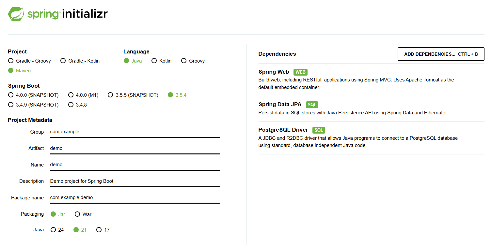
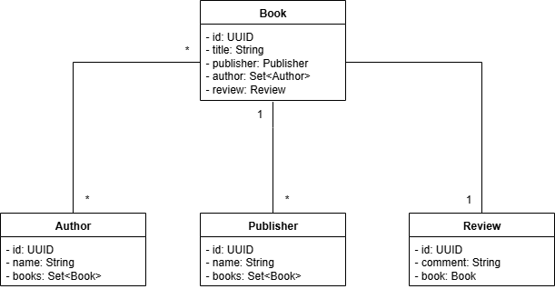

# 📚 Bookstore App JPA

[](https://www.oracle.com/java/)
[](https://spring.io/projects/spring-boot)
[](https://www.postgresql.org/)
[](https://maven.apache.org/)
[](LICENSE)

# 🚀 Objetivo
- Criar uma aplicação de um Bookstore para praticar JPA, Spring e PostgreSQL

# Preparação do Ambiente
- Requisitos necessários:
    - JDK 21 
    - Maven
    - Postman
    - PgAdmin (Postgres)
    - IDE (IntelliJ, STS, Eclipse, VSCode, etc)

# Iniciando o projeto
- Para começar, gere o projeto no [Spring Initializr](https://start.spring.io/)
- As dependências necessárias a serem adicionadas são:
    - Spring Web
    - Spring Data JPA
    - PostgreSQL Driver
- Escolha o Maven como Project, linguagem Java e a versão 21.
- A imagem abaixo ilustra como deve ser feita a configuração:




<br>

# Diagrama UML de Classes




<br>


# SHOW ME THE CODE!!!

## 🏗 Arquitetura do Projeto
- O projeto segue uma arquitetura em múltiplas camadas com separação clara de responsabilidades.
- Essa abordagem facilita testes, manutenção e evolução do código.

## 1️⃣ Camada Controller — Interface com o Cliente
📂 **Pacote:** `controller`  
- Recebe requisições HTTP via **endpoints REST**.
- Converte dados recebidos em **DTOs** e envia para o **Service**.
- Retorna respostas padronizadas (`ResponseEntity`), encapsulando status e corpo.
- **Não contém lógica de negócio**.

- Exemplo:
```java
@RestController
@RequestMapping("/books")
public class BookController {

    private final BookService bookService;

    public BookController(BookService bookService) {
        this.bookService = bookService;
    }

    @GetMapping("/{id}")
    public ResponseEntity<BookDTO> findById(@PathVariable Long id) {
        return ResponseEntity.ok(bookService.findById(id));
    }

    @PostMapping
    public ResponseEntity<BookDTO> create(@RequestBody BookDTO bookDTO) {
        return ResponseEntity.status(HttpStatus.CREATED).body(bookService.create(bookDTO));
    }
}
```

## 2️⃣ Camada Service — Regras de Negócio
📂 Pacote: service
- Contém toda a lógica de negócio e validações.
- Converte DTOs em Entities e vice-versa.
- Orquestra operações de persistência via Repository.
- Pode lançar exceções personalizadas (BookNotFoundException).
- Exemplo    
```java
@Service
public class BookService {

    private final BookRepository bookRepository;

    public BookService(BookRepository bookRepository) {
        this.bookRepository = bookRepository;
    }

    public BookDTO findById(Long id) {
        Book book = bookRepository.findById(id)
            .orElseThrow(() -> new BookNotFoundException(id));
        return new BookDTO(book);
    }

    public BookDTO create(BookDTO dto) {
        Book book = new Book(dto);
        return new BookDTO(bookRepository.save(book));
    }
}
```

## Camada Repository — Acesso a Dados
📂 Pacote: repository
- Interface de comunicação com o banco de dados.
- Extende JpaRepository, fornecendo métodos prontos (`findAll`, `findById`, `save`, dentre outros).
- Pode conter consultas personalizadas via JPQL ou @Query.

- Exemplo:
```java
@Repository
public interface BookRepository extends JpaRepository<Book, Long> {
    List<Book> findByAuthor(String author);
}
```

## 4️⃣ Camada Model/Entity — Mapeamento ORM
📂 Pacote: model ou entity
- Representa as tabelas do banco de dados.
- Usa anotações JPA para mapear atributos (@Entity, @Table, @Column, @Id).
- Pode conter relacionamentos (@OneToMany, @ManyToOne).
- Exemplo:
```java
@Entity
@Table(name = "books")
public class Book {

    @Id
    @GeneratedValue(strategy = GenerationType.IDENTITY)
    private Long id;

    @Column(nullable = false)
    private String title;

    @Column(nullable = false)
    private String author;

    @Column(nullable = false)
    private Double price;

    public Book() {}
    
    public Book(BookDTO dto) {
        this.title = dto.getTitle();
        this.author = dto.getAuthor();
        this.price = dto.getPrice();
    }
}
```

## 5️⃣ DTOs (Data Transfer Objects)
📂 Pacote: dto
- Objetos simples usados para transportar dados.
- Evitam exposição direta das entidades.
- Facilitam validações e garantem segurança.
- Exemplo:
```java
public class BookDTO {
    private Long id;
    private String title;
    private String author;
    private Double price;

    public BookDTO() {}
    
    public BookDTO(Book entity) {
        this.id = entity.getId();
        this.title = entity.getTitle();
        this.author = entity.getAuthor();
        this.price = entity.getPrice();
    }
}
```

## 🗄 Estrutura de Banco de Dados
- Gerenciada automaticamente pelo Hibernate a partir das entidades.
- Exemplo de criação de tabela:
```sql
CREATE TABLE books (
id SERIAL PRIMARY KEY,
title VARCHAR(255) NOT NULL,
author VARCHAR(255) NOT NULL,
price DECIMAL(10,2) NOT NULL
);
```
## ⚙️ Como Executar

```bash
# Clonar o repositório
git clone https://github.com/pedro-mileipp/bookstore_app_jpa.git

# Configurar o application.properties
spring.datasource.url=jdbc:postgresql://localhost:[porta_do_banco]/[database]
spring.datasource.username=SEU_USUARIO
spring.datasource.password=SUA_SENHA

# Na pasta, executar o comando abaixo
./mvnw spring-boot:run
```